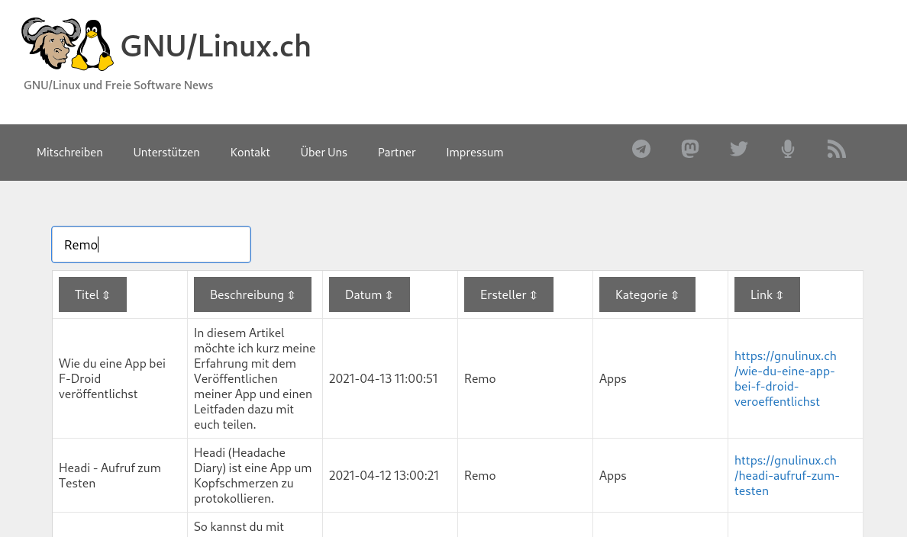

# sitemap-table-generator
A Bludit plugin that generates a sotable and searchable table from the overview (json from the API) of all blogposts.

## Requirement
TODO 

## Settings
| Setting | Description | Example |
|-|-|-|
| Relative path to the pages.json file | Realtive path starting from $_SERVER['DOCUMENT_ROOT']. | `/siteindex/pages.json` |
| Webhook for the sitemap | The sitemap table can be reached under this address (www.example.com/webhook). | `sitemap-table` |
| Page title | If a page title exists, an h1 heading is added on top. | Blogpost index |
| Tables header | The tables header and the plaintext to it. The order  must match the order from the JSON file. | `title Title\|description Description\|dateRaw Date` |
| Enable search field | If the search field is enabled (1 or true), the search field will be displayed. | `1` |
| Enable sort columns | If column sorting is enabled (1 or true), each column can be sorted individually. | `true` |

## License
~~~
MIT License

Copyright (c) 2021 MrReSc

Permission is hereby granted, free of charge, to any person obtaining a copy
of this software and associated documentation files (the "Software"), to deal
in the Software without restriction, including without limitation the rights
to use, copy, modify, merge, publish, distribute, sublicense, and/or sell
copies of the Software, and to permit persons to whom the Software is
furnished to do so, subject to the following conditions:

The above copyright notice and this permission notice shall be included in all
copies or substantial portions of the Software.

THE SOFTWARE IS PROVIDED "AS IS", WITHOUT WARRANTY OF ANY KIND, EXPRESS OR
IMPLIED, INCLUDING BUT NOT LIMITED TO THE WARRANTIES OF MERCHANTABILITY,
FITNESS FOR A PARTICULAR PURPOSE AND NONINFRINGEMENT. IN NO EVENT SHALL THE
AUTHORS OR COPYRIGHT HOLDERS BE LIABLE FOR ANY CLAIM, DAMAGES OR OTHER
LIABILITY, WHETHER IN AN ACTION OF CONTRACT, TORT OR OTHERWISE, ARISING FROM,
OUT OF OR IN CONNECTION WITH THE SOFTWARE OR THE USE OR OTHER DEALINGS IN THE
SOFTWARE.
~~~

## Credits
* [list.js](https://listjs.com/) from [@javve](https://github.com/javve) provides the ability to search and sort
* [@LiohMoeller](https://github.com/LiohMoeller) has contributed code